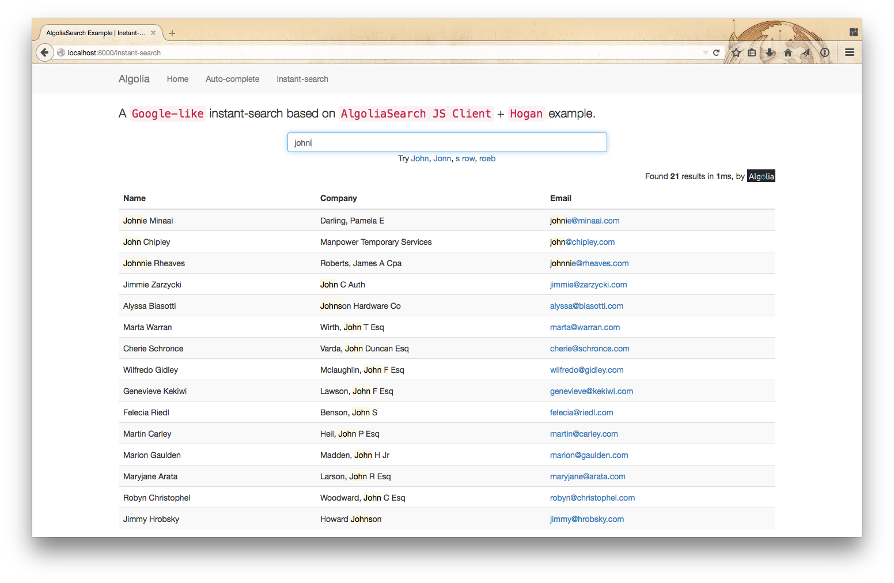

# AlgoliaSearch Django Example

This is a Django application indexing 500 `Contact` objects and providing auto-completion and instant-search samples. See [algoliasearch-django](https://github.com/algolia/algoliasearch-django) package.

A `Contact` is defined by:

* A name
* An email adress
* A company name

An [Algolia](https://www.algolia.com) account is required to test it.

## Dependencies

```bash
$ pip install algoliasearch-django
```

## Installation

```bash
$ git clone https://github.com/algolia/algoliasearch-django-example
$ cd algoliasearch-django-example
$ python manage.py createsuperuser # needed for the admin page
```

## Populate your DB and start indexing

```bash
$ python manage.py loaddata contacts.json
$ ALGOLIA_APPLICATION_ID=XXXXX ALGOLIA_API_KEY=XXXXX python manage.py algolia_reindex
```

Or you can add your credentials in the `core/settings.py` and then start indexing:

```bash
$ python manage.py algolia_reindex
```

## Start the application

```bash
$ ALGOLIA_APPLICATION_ID=XXXXX ALGOLIA_API_KEY=XXXXX ALGOLIA_SEARCH_API_KEY=XXXXX python manage.py runserver
```

Or if you added your credentials in the setting file:

```bash
$ python manage.py runserver
```

Enjoy your `http://localhost:8000` examples!


